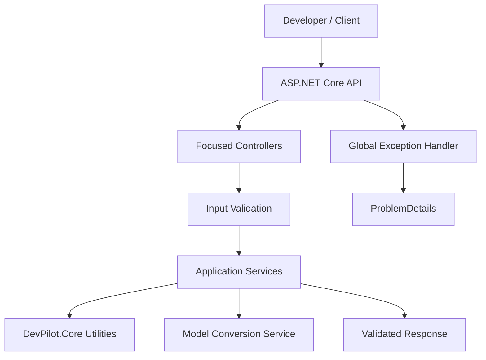

# 🚀 DevPilot

[](https://dotnet.microsoft.com/)
[](https://learn.microsoft.com/aspnet/core/)
[](https://www.nuget.org/)
[](LICENSE)
[](#development)

DevPilot is a modular **.NET 8 developer productivity toolkit** exposing practical utilities through documented REST APIs, with reusable functionality available through the `DevPilot.Core` NuGet package.

## ✨ Features

- JSON validation and formatting
- Base64 encoding and decoding
- SHA256 and SHA512 hashing
- GUID and UTC timestamp generation
- Recursive JSON → C# model generation
- Recursive XML → C# model generation
- C# property declarations → JSON/XML templates
- Separate controllers based on single responsibility
- Swagger/OpenAPI documentation
- Request validation with clear 400 responses
- Global `ProblemDetails` error handling for unexpected failures
- Health endpoint for deployment and monitoring checks
- Runnable REST request examples
- Reusable `DevPilot.Core` library

## 🏗️ Architecture



See the detailed diagrams in [`docs/architecture.md`](docs/architecture.md).

## ⚡ Quick Start — Web API

### Prerequisites

- .NET 8 SDK
- Git
- Optional: Visual Studio 2022, VS Code, or Rider

### Installation

```bash
git clone https://github.com/azam123/DevPilot.git
cd DevPilot
dotnet restore
dotnet build
dotnet run
```

Open the Swagger UI address printed in the terminal, typically:

```text
https://localhost:<port>/swagger
```

In Swagger, select an endpoint → **Try it out** → provide input → **Execute**.

> 🎨 **Colorful animated-style setup guide:** See [`docs/installation-and-setup.md`](docs/installation-and-setup.md) for a step-by-step guide with colorful markers, command highlighting, expandable troubleshooting sections, and a Mermaid setup flow.

### Health check

After starting the API, call:

```bash
curl -k https://localhost:<port>/api/health
```

Expected response shape:

```json
{
  "status": "healthy",
  "service": "DevPilot",
  "utc": "2026-09-19T00:00:00+00:00"
}
```

### REST examples

Runnable examples are available in [`Examples/DevPilot.http`](Examples/DevPilot.http). They cover health checks, JSON-to-C# conversion, invalid-input handling, and JSON formatting.

## 🛡️ Validation & Error Handling

Model-conversion inputs are validated before parsing or code generation:

- Input is required and limited to 1 MB.
- Root type is required and limited to 100 characters.
- Root names must be valid C#-style identifiers.
- Invalid arguments return HTTP 400.
- Unexpected exceptions are logged server-side and returned as `ProblemDetails`.
- Production responses avoid leaking internal exception details.

This keeps the API predictable for clients while avoiding unnecessary parsing work for invalid requests.

## 🔌 API Reference

### Model conversion request

```json
{
  "input": "{\"customer\":{\"name\":\"Azam\"}}",
  "root": "CustomerResponse"
}
```

| Method | Endpoint | Purpose |
|---|---|---|
| GET | `/api/health` | Lightweight health/status check |
| POST | `/api/json-to-csharp` | Generate nested C# models from JSON |
| POST | `/api/xml-to-csharp` | Generate C# models from XML |
| POST | `/api/csharp-to-json` | Generate a JSON template from C# properties |
| POST | `/api/csharp-to-xml` | Generate an XML template from C# properties |
| POST | `/api/json/format` | Validate and format JSON |
| POST | `/api/base64` | Encode or decode Base64 |
| POST | `/api/hash` | Generate SHA256 or SHA512 |
| GET | `/api/utility/guid` | Generate a GUID |
| GET | `/api/utility/timestamp` | Get UTC and Unix timestamps |

## 🧱 Project Structure

```text
DevPilot/
├── Api/                       # Focused API controllers
├── Services/                  # Application services + validation
├── Infrastructure/            # Global error handling
├── Examples/                  # Runnable HTTP examples
├── docs/                      # Architecture + installation guides
├── src/
│   └── DevPilot.Core/         # Reusable NuGet library
│       ├── DevPilot.Core.csproj
│       └── DeveloperUtilities.cs
├── wwwroot/                   # Frontend assets
├── DevPilot.csproj            # Web API project
├── Program.cs
└── README.md
```

## 📦 NuGet Package

The reusable library project is located at `src/DevPilot.Core`.

### Build the package locally

```bash
dotnet restore src/DevPilot.Core/DevPilot.Core.csproj
dotnet build src/DevPilot.Core/DevPilot.Core.csproj -c Release
dotnet pack src/DevPilot.Core/DevPilot.Core.csproj -c Release -o ./artifacts
```

### Use the package

```bash
dotnet add package DevPilot.Core --version 0.1.0
```

> The repository contains NuGet packaging/publishing configuration, but this documentation does **not** claim that a package was published. Publication should only be considered successful after a NuGet/GitHub Actions push has completed successfully.

## 🧪 Development

```bash
dotnet format
dotnet build
dotnet test
```

Use the HTTP examples for quick manual verification. For production contributions, add unit/integration tests for new behavior before merging.

## 🗺️ Improvement Roadmap

- [ ] Add automated unit and integration test projects
- [x] Add global exception handling and ProblemDetails
- [ ] Add request rate limiting
- [ ] Add Roslyn-based C# parsing for safer model conversion
- [ ] Add structured logging and deeper health checks
- [ ] Expand reusable NuGet APIs
- [ ] Add versioned API documentation

## 📄 License

Licensed under the GNU General Public License v3.0. See [LICENSE](LICENSE).
