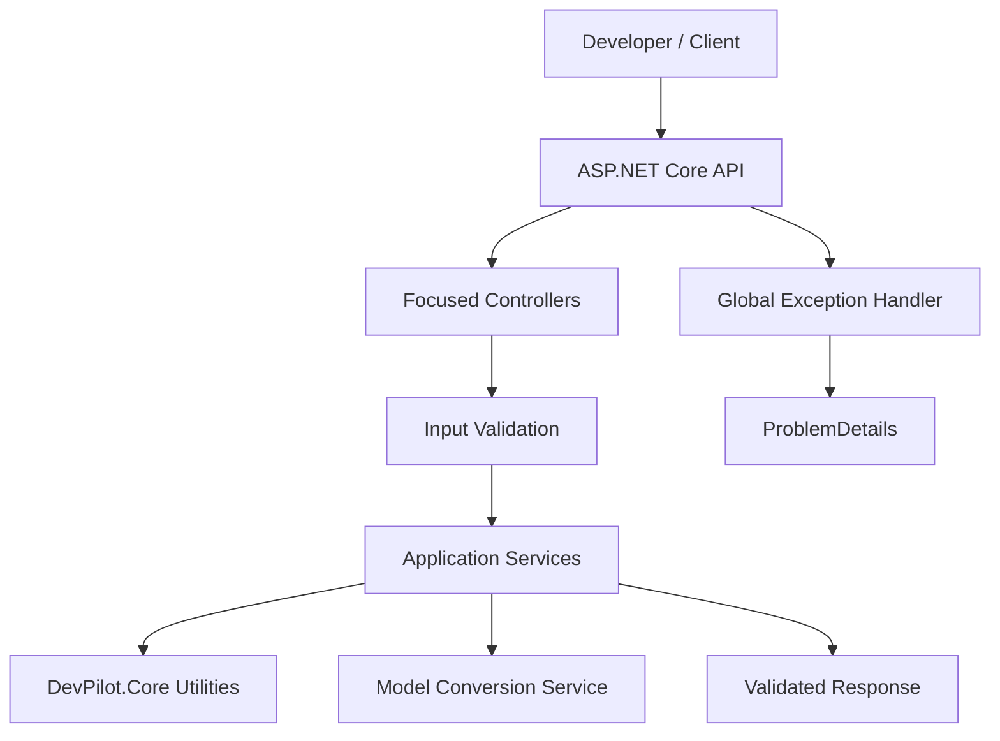

# 🚀 DevPilot

[](https://dotnet.microsoft.com/)
[](https://learn.microsoft.com/aspnet/core/)
[](https://www.nuget.org/)
[](LICENSE)

DevPilot is a modular **.NET 8 developer productivity toolkit** exposing practical utilities through documented REST APIs, with reusable functionality available through the `DevPilot.Core` NuGet package.

## ✨ Features

- JSON validation and formatting
- Base64 encoding and decoding
- SHA256 and SHA512 hashing
- URL component encoding and decoding
- **HTTP/HTTPS URL validation and inspection** without making network calls
- GUID and UTC timestamp generation
- Recursive JSON → C# model generation
- Recursive XML → C# model generation
- C# property declarations → JSON/XML templates
- Focused controllers based on single responsibility
- Swagger/OpenAPI documentation
- Request validation with clear 400 responses
- Global `ProblemDetails` error handling for unexpected failures
- Health endpoint for deployment and monitoring checks
- Runnable REST request examples
- Reusable `DevPilot.Core` library
- Automated build, test, and NuGet package validation in GitHub Actions

## 🏗️ Architecture



See [`docs/architecture.md`](docs/architecture.md) for request sequence diagrams, URL validation flow, and design principles.

## ⚡ Quick Start — Web API

### Prerequisites

- .NET 8 SDK
- Git
- Optional: Visual Studio 2022, VS Code, or Rider

### Installation

```bash
git clone https://github.com/azam123/DevPilot.git
cd DevPilot
dotnet restore DevPilot.csproj
dotnet build DevPilot.csproj
dotnet run --project DevPilot.csproj
```

Open the Swagger UI address printed in the terminal, typically:

```text
https://localhost:<port>/swagger
```

In Swagger, select an endpoint → **Try it out** → provide input → **Execute**.

### Health check

```bash
curl -k https://localhost:<port>/api/health
```

### URL encoding example

```bash
curl -k https://localhost:<port>/api/encoding/url/encode \
  -H "Content-Type: application/json" \
  -d '{"value":"name=Azam & role=Principal Engineer"}'
```

Example response:

```json
{
  "value": "name%3DAzam%20%26%20role%3DPrincipal%20Engineer"
}
```

### URL validation example

```bash
curl -k https://localhost:<port>/api/validation/url \
  -H "Content-Type: application/json" \
  -d '{"value":"https://example.com/products?page=2"}'
```

The endpoint validates that the input is an **absolute HTTP/HTTPS URL** and returns parsed components such as scheme, host, port, path, query presence, and fragment presence. It never performs an outbound request.

### REST examples

Runnable examples are available in [`Examples/DevPilot.http`](Examples/DevPilot.http). They cover health checks, model conversion, invalid-input handling, JSON formatting, URL encoding/decoding, and URL validation.

## 🛡️ Validation & Error Handling

Model-conversion inputs are validated before parsing or code generation. Encoding and URL-validation endpoints also reject missing or oversized values before processing.

- Required values are checked before processing.
- Model-conversion input is limited to 1 MB.
- URL validation input is limited to 2048 characters.
- URL validation accepts only absolute `http` and `https` URLs.
- Root type is limited to 100 characters and validated as a C# identifier.
- Invalid arguments return HTTP 400.
- Unexpected exceptions are logged server-side and returned as `ProblemDetails`.
- Production responses avoid leaking internal exception details.

This keeps the API predictable for clients while avoiding unnecessary parsing or network work for invalid requests.

## 🔌 API Reference

| Method | Endpoint | Purpose |
|---|---|---|
| GET | `/api/health` | Lightweight health/status check |
| POST | `/api/json-to-csharp` | Generate nested C# models from JSON |
| POST | `/api/xml-to-csharp` | Generate C# models from XML |
| POST | `/api/csharp-to-json` | Generate a JSON template from C# properties |
| POST | `/api/csharp-to-xml` | Generate an XML template from C# properties |
| POST | `/api/json/format` | Validate and format JSON |
| POST | `/api/base64` | Encode or decode Base64 |
| POST | `/api/hash` | Generate SHA256 or SHA512 |
| POST | `/api/encoding/url/encode` | URL-component encode text |
| POST | `/api/encoding/url/decode` | URL-component decode text |
| POST | `/api/validation/url` | Validate and inspect an HTTP/HTTPS URL |
| GET | `/api/utility/guid` | Generate a GUID |
| GET | `/api/utility/timestamp` | Get UTC and Unix timestamps |

## 🧱 Project Structure

```text
DevPilot/
├── Api/                       # Focused API controllers
├── Services/                  # Application services + validation
├── Infrastructure/            # Global error handling
├── Examples/                  # Runnable HTTP examples
├── docs/                      # Architecture + setup guides
├── src/
│   └── DevPilot.Core/         # Reusable NuGet library
│       ├── DevPilot.Core.csproj
│       ├── DeveloperUtilities.cs
│       ├── EncodingUtilities.cs
│       └── UriUtilities.cs
├── tests/
│   └── DevPilot.Core.Tests/   # xUnit tests for reusable utilities
├── .github/workflows/         # CI build/test/package workflow
├── wwwroot/                   # Frontend assets
├── DevPilot.csproj            # Web API project
└── Program.cs
```

## 📦 NuGet Package

The reusable library project is located at `src/DevPilot.Core`.

### Build the package locally

```bash
dotnet restore src/DevPilot.Core/DevPilot.Core.csproj
dotnet build src/DevPilot.Core/DevPilot.Core.csproj -c Release
dotnet pack src/DevPilot.Core/DevPilot.Core.csproj -c Release -o ./artifacts
```

The current project version is **0.2.0**.

> The repository contains NuGet packaging configuration and CI package validation, but this README does **not** claim that a package was published. Publication should only be considered successful after a NuGet/GitHub Actions push has completed successfully.

## 🧪 Development & Testing

```bash
dotnet restore DevPilot.csproj
dotnet build DevPilot.csproj --configuration Release
dotnet restore tests/DevPilot.Core.Tests/DevPilot.Core.Tests.csproj
dotnet test tests/DevPilot.Core.Tests/DevPilot.Core.Tests.csproj --configuration Release
```

The test project covers Base64 UTF-8 round trips, deterministic SHA256 hashing, URL encoding round trips, null-input validation, and HTTP/HTTPS URL validation/normalization.

GitHub Actions runs restore, build, test, and `dotnet pack` for the reusable package on pushes and pull requests targeting `main`.

## 🗺️ Improvement Roadmap

- [x] Add automated core unit tests
- [x] Add global exception handling and ProblemDetails
- [x] Add URL encoding/decoding utility
- [x] Add HTTP/HTTPS URL validation utility
- [x] Add CI build/test/package validation
- [ ] Add request rate limiting
- [ ] Add Roslyn-based C# parsing for safer model conversion
- [ ] Add structured logging and deeper health checks
- [ ] Expand reusable NuGet APIs
- [ ] Add versioned API documentation

## 📄 License

Licensed under the GNU General Public License v3.0. See [LICENSE](LICENSE).
