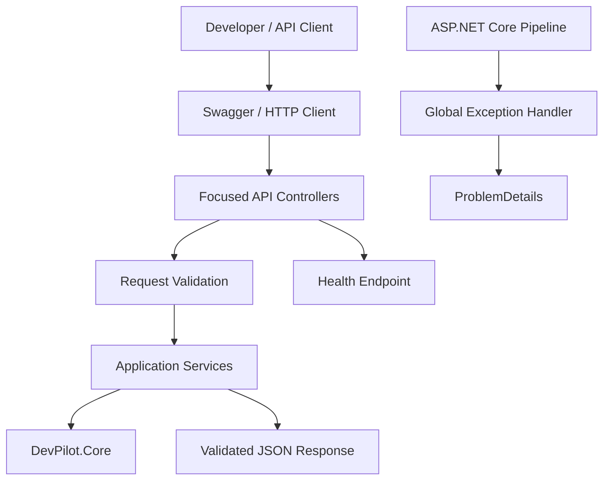
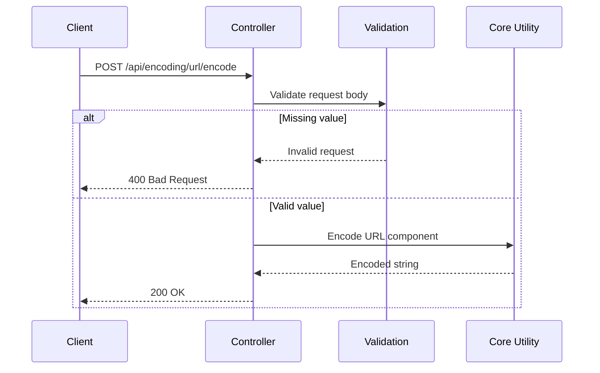
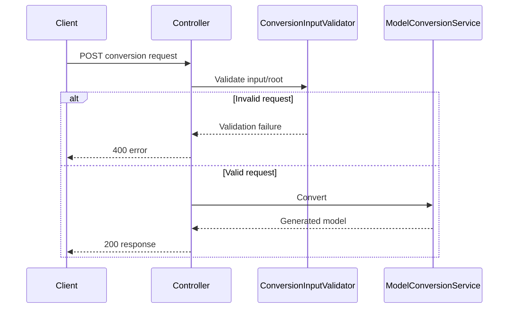

# DevPilot Architecture

DevPilot uses a small, modular ASP.NET Core architecture. Controllers focus on HTTP concerns, services own conversion logic, and the reusable `DevPilot.Core` package contains dependency-free utilities.

## Utility request flow

## Conversion request flow

## Design principles

- Keep controllers thin and focused on HTTP concerns.
- Keep reusable, dependency-free behavior in `DevPilot.Core`.
- Validate untrusted input before expensive parsing.
- Return predictable HTTP errors.
- Never expose internal exception details in production.
- Keep examples runnable with the REST Client extension or similar HTTP tooling.
- Add tests for reusable behavior and keep CI responsible for build/test/package validation.
