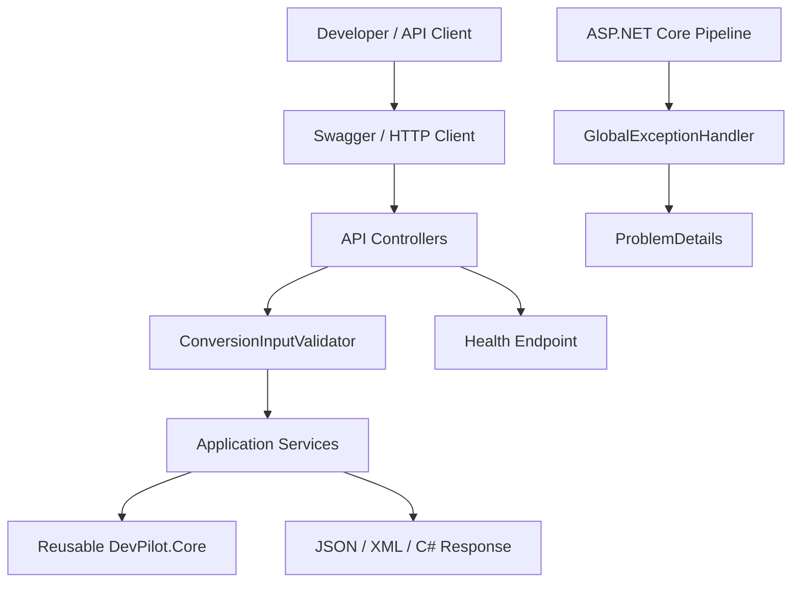
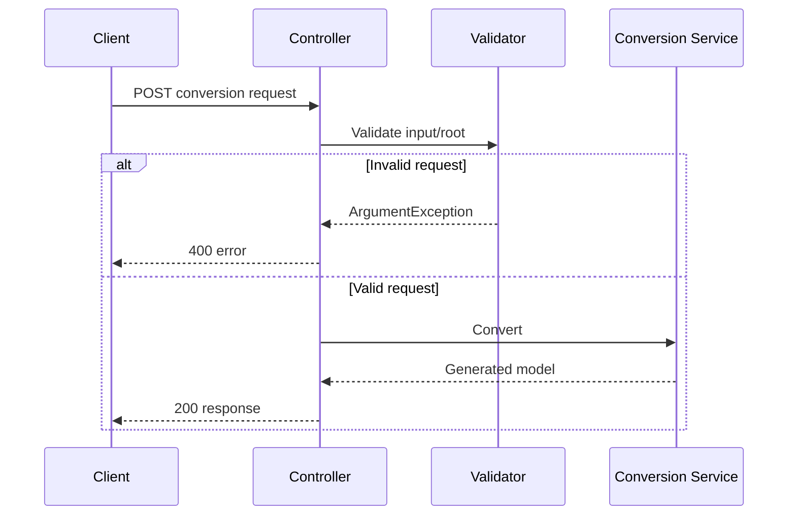

# DevPilot Architecture

DevPilot follows a small, modular ASP.NET Core architecture. Controllers focus on HTTP concerns, services own conversion logic, and shared infrastructure handles validation and unexpected failures.

## Conversion request flow

## Design principles

- Keep controllers thin and services reusable.
- Validate untrusted input before expensive parsing.
- Return predictable HTTP errors.
- Never expose internal exception details in production.
- Keep examples runnable with the REST Client extension or similar HTTP tooling.
