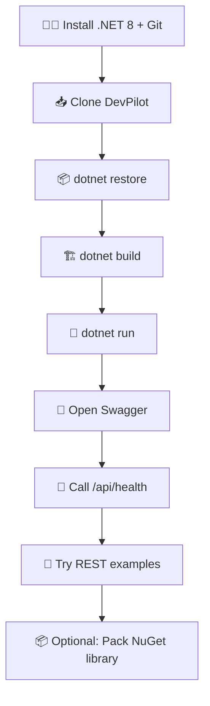

# 🎨 DevPilot Installation & Setup Guide

> ✨ **Animated-style learning path:** follow the glowing steps from **0️⃣ → 1️⃣ → 2️⃣ → 3️⃣ → 🚀**
>
> GitHub Markdown does not reliably support custom font colors or CSS animations. This guide uses colorful emoji markers, badges, callouts, syntax-highlighted command blocks, and expandable sections for a consistent GitHub-friendly experience.

<p align="center">
  
  
  
</p>

## 🧭 0️⃣ Prerequisites

Before starting, install:

- 🟣 **.NET 8 SDK**
- 🟢 **Git**
- 🔵 Optional IDE: Visual Studio 2022, VS Code, or JetBrains Rider
- 🟡 Optional: REST Client extension for VS Code or another HTTP client

Verify your tools:

```bash
# 🟣 Check .NET SDK
 dotnet --version

# 🟢 Check Git
git --version
```

> ✅ **Success checkpoint:** the .NET version should be compatible with .NET 8, and Git should print its installed version.

---

## 📥 1️⃣ Clone the repository

```bash
# 🔵 Download DevPilot
git clone https://github.com/azam123/DevPilot.git

# 🟢 Move into the project folder
cd DevPilot
```

<details>
<summary>🧩 If you already cloned the repository</summary>

```bash
cd DevPilot
git pull origin main
```

</details>

---

## 📦 2️⃣ Restore dependencies

Restore all NuGet dependencies required by the project:

```bash
# 🟣 Restore project dependencies
dotnet restore
```

> 💡 **Tip:** If restore fails, check your SDK version, internet connection, and configured NuGet sources.

---

## 🏗️ 3️⃣ Build the application

Compile the application before running it:

```bash
# 🟢 Build in Debug mode
dotnet build
```

For a release build:

```bash
# 🔷 Build in Release mode
dotnet build -c Release
```

> ✅ **Success checkpoint:** the build should finish without compilation errors.

---

## 🚀 4️⃣ Run DevPilot

Start the ASP.NET Core API:

```bash
# 🚀 Start the API
dotnet run
```

The terminal will display the local listening address, for example:

```text
Now listening on: https://localhost:7xxx
Now listening on: http://localhost:5xxx
```

> ⚠️ **Port note:** use the exact port printed by your terminal. Do not assume that the sample port numbers are identical on every machine.

---

## 🧪 5️⃣ Open Swagger UI

Open the Swagger address shown in the terminal:

```text
https://localhost:<port>/swagger
```

Then:

1. 🟦 Select an endpoint.
2. 🟨 Click **Try it out**.
3. 🟩 Enter the request payload.
4. 🟪 Click **Execute**.
5. 🟢 Inspect the HTTP status and response body.

Swagger is useful for exploring the API without writing a separate client.

---

## 💚 6️⃣ Verify the health endpoint

Use the health endpoint to confirm that the API is responding:

```bash
# 🟢 Linux/macOS/Git Bash
curl -k https://localhost:<port>/api/health
```

For PowerShell:

```powershell
# 🔵 Windows PowerShell
Invoke-RestMethod -Uri "https://localhost:<port>/api/health" -Method Get
```

Expected response shape:

```json
{
  "status": "healthy",
  "service": "DevPilot",
  "utc": "2026-09-19T00:00:00+00:00"
}
```

> 🔐 `-k` is convenient for local development when using a development HTTPS certificate. Avoid disabling certificate validation in production clients.

---

## 🛠️ 7️⃣ Run REST examples

Open [`Examples/DevPilot.http`](../Examples/DevPilot.http) in VS Code with the REST Client extension or use a compatible HTTP tool.

The examples cover:

- 💚 Health checks
- 🟣 JSON → C# conversion
- 🔴 Invalid-input handling
- 🔵 JSON formatting

> 🎯 **Learning loop:** change one request → execute → inspect the response → adjust the input → repeat.

---

## 🛡️ 8️⃣ Validation and error handling

DevPilot validates conversion input before parsing or code generation.

| Validation | Behavior |
|---|---|
| Empty input | Returns HTTP `400` |
| Input above 1 MB | Returns HTTP `400` |
| Missing root name | Returns HTTP `400` |
| Invalid root identifier | Returns HTTP `400` |
| Unexpected server failure | Returns `ProblemDetails` response |

Unexpected errors are logged server-side. Production responses should not expose internal exception details.

---

## 📦 9️⃣ Build the NuGet package locally

The reusable library is located at `src/DevPilot.Core`.

```bash
# 🟣 Restore the core library
dotnet restore src/DevPilot.Core/DevPilot.Core.csproj

# 🔷 Build the core library
dotnet build src/DevPilot.Core/DevPilot.Core.csproj -c Release

# 🟢 Create a local NuGet package
 dotnet pack src/DevPilot.Core/DevPilot.Core.csproj -c Release -o ./artifacts
```

The generated package will be placed in the `artifacts` directory.

> 📌 **Publication disclaimer:** creating a local `.nupkg` file does not mean the package was published. Only report publication after a package push completes successfully and is verified.

---

## 🧹 🔟 Developer quality checks

Run formatting, build, and tests where configured:

```bash
# 🟢 Format the code
dotnet format

# 🔵 Build the solution
dotnet build

# 🟣 Run tests
dotnet test
```

If no test project exists yet, `dotnet test` may report that there are no tests to run. Add tests for new behavior before merging production changes.

---

## 🧯 Troubleshooting

<details>
<summary>🔴 Port already in use</summary>

Run the application with a different URL:

```bash
dotnet run --urls "https://localhost:7443"
```

</details>

<details>
<summary>🟠 HTTPS development certificate issue</summary>

Trust or recreate the local development certificate using the .NET CLI for your operating system:

```bash
dotnet dev-certs https --check
dotnet dev-certs https --trust
```

</details>

<details>
<summary>🟡 Restore or package errors</summary>

Try clearing local NuGet caches and restoring again:

```bash
dotnet nuget locals all --clear
dotnet restore
```

</details>

---

## 🗺️ Setup flow



## ✅ Final checklist

- [ ] .NET 8 SDK installed
- [ ] Repository cloned
- [ ] Dependencies restored
- [ ] Build completed successfully
- [ ] API started locally
- [ ] Swagger opened
- [ ] Health endpoint verified
- [ ] REST examples executed
- [ ] Quality checks run

🎉 **You are ready to explore DevPilot!**